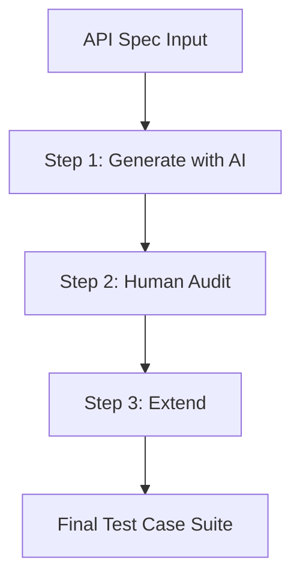

# API Test Case Design Skill (HW6 Standard)

This skill guides both AI assistants and human testers on how to collaborate and design a high-quality API test suite from any API specification (OpenAPI, Swagger, Markdown, or raw endpoint description), following the 3-step HW6 pipeline.

---

## 🛠️ The 3-Step Design Pipeline (HW6 Pipeline)



---

## 📌 Step 1 — Generate with AI

When requested to design test cases for an API, the AI assistant should apply standard black-box testing techniques to generate at least **35 test cases** (for HW6) or **10 test cases** (for the Mini Exercise).

### A. Mandatory Test Categories:
1. **Happy Path**: Valid requests with typical parameters to verify core business logic.
2. **Domain Partitions (Equivalence Partitioning)**: Divide inputs (e.g., `id`, `email`, `price`) into valid and invalid classes.
3. **Boundary Value Analysis (BVA)**: Edge cases of parameters (e.g., max/min string length, numeric limits, token expiration boundaries).
4. **Security & Authentication**:
   - Missing, malformed, or expired tokens (`401 Unauthorized`).
   - Access control and privilege escalation (e.g., user attempting to access admin routes -> `403 Forbidden`).
   - Basic security vulnerabilities (SQL Injection, IDOR by tampering with resource IDs).
5. **Schema Validation**: Verify that the response body structure matches the specification exactly (required fields, types, formats).

### B. Output Test Case Table Format:
The AI must return the results in the following Markdown table format:

| TC ID | Endpoint | Scenario Description | Input / Request Payload | Expected Status | Expected Response Shape | Testing Technique |
| :--- | :--- | :--- | :--- | :---: | :--- | :--- |
| TC-01 | `GET /product/:id` | Happy path with valid product ID | Path: `id=10`<br>Auth: Bearer ValidToken | 200 | Body contains: `{id, type, name, version}` | Happy path |
| TC-02 | `GET /product/:id` | Non-existing product ID | Path: `id=9999`<br>Auth: Bearer ValidToken | 404 | Body contains: `{message}` | Equivalence Partitioning |

---

## 🔍 Step 2 — Audit (Human Review)

All AI-generated test cases must be reviewed and audited by the human tester using the following labels:

- **`VALID`**: The test case is logical, correct, and the expected status/body matches real API behavior.
- **`INVALID`**: Incorrect logic, or expected behavior does not match actual API routing rules (e.g., expecting a 400 for a string ID when the router actually throws a 404).
- **`INCOMPLETE`**: Missing critical details (e.g., missing expected headers, missing required fields, or vague descriptions).

### Sample Audit Table:
| TC ID | Label | Detailed Feedback / Reasoning | Correction / Refinement Plan |
| :--- | :---: | :--- | :--- |
| TC-02 | `VALID` | Matches the specification perfectly | Keep as is |
| TC-03 | `INCOMPLETE` | Missing the expected error body structure | Add expectation that the response body contains `error` |
| TC-05 | `INVALID` | AI assumed `id=abc` returns 400, but Express router returns 404 | Update expected status code from 400 to 404 |

---

## 📈 Step 3 — Extend (Manual Test Cases)

AI often misses deep business logic, performance constraints, or complex state transitions. The human tester must manually add at least **5 test cases** (for HW6) or **2 test cases** (for the Mini Exercise).

### Areas the AI Frequently Misses:
- **Response Headers**: Verifying `Content-Type: application/json`, `Cache-Control`, or security headers.
- **Response Time / Performance**: Asserting response time limits (e.g., response time < 1000ms).
- **State Transition**: Multi-step workflows (e.g., `POST /order` (pending) -> `PUT /order/confirm` (confirmed) -> `DELETE /order` (should fail to cancel a confirmed order)).
- **Token Edge Cases**: Tokens with timestamp in the far future, or different ISO timezone formats.

---

## 💬 Recommended Prompt Template

Users can copy and paste the following prompt to drive the AI to generate the test cases:

```text
Act as a senior QA engineer. I need you to design a comprehensive API test suite for the following endpoint(s) based on this specification:

[PASTE YOUR API SPECIFICATION OR CONTRACT HERE]

Specific Requirements:
1. Propose at least [NUMBER] test cases covering: Happy Path, Domain Partitions (valid/invalid types), Boundary Values, Security/Authentication, and Response Schema Validation.
2. Return the test suite as a Markdown table with columns: TC ID, Endpoint, Scenario Description, Input / Request Payload, Expected Status, Expected Response Shape, Testing Technique.
3. Strictly follow the spec. Do not assume behaviors not documented; list any assumptions explicitly.
```
