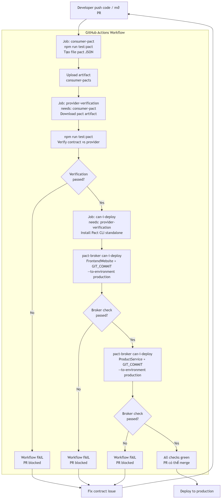

# Hướng dẫn Can-I-Deploy & Quality Gate trong CI/CD

> **Dự án:** API & Contract Testing — Nhóm 3 SEBros
> **Task:** W07 — Nguyên An (23127148)
> **Stack:** Pact CLI Standalone · GitHub Actions · Pactflow Broker

---

## Mục lục

- [1. Can-I-Deploy là gì?](#1-can-i-deploy-là-gì)
- [2. Tại sao cần Quality Gate?](#2-tại-sao-cần-quality-gate)
- [3. Cấu hình GitHub Secrets](#3-cấu-hình-github-secrets)
- [4. Flow đầy đủ từ commit đến merge/block](#4-flow-đầy-đủ-từ-commit-đến-mergeblock)
- [5. Ví dụ output khi pass và fail](#5-ví-dụ-output-khi-pass-và-fail)
- [6. Troubleshooting](#6-troubleshooting)

---

## 1. Can-I-Deploy là gì?

`can-i-deploy` là lệnh của Pact Broker CLI dùng để **hỏi broker** một câu hỏi duy nhất:

> "Phiên bản `X` của service `Y` có đủ điều kiện để deploy lên môi trường `production` ngay bây giờ không?"

Broker trả lời bằng cách kiểm tra **verification matrix** — bảng ghi lại mọi cặp `(consumer version, provider version)` đã được verify thành công. Nếu phiên bản đang xét đã verified với tất cả counterpart đang chạy ở `production`, lệnh trả về exit code `0` (pass). Ngược lại, exit code `1` (fail).

### Tại sao dùng Git SHA làm version?

Mỗi commit tạo ra một SHA duy nhất. Khi dùng SHA làm `--version`:

- Pact Broker có thể trace chính xác pact nào được tạo bởi commit nào.
- `can-i-deploy` so sánh đúng version đang được kiểm tra — không bị nhầm với version cũ.
- CI/CD không cần quản lý semantic versioning thủ công.

---

## 2. Tại sao cần Quality Gate?

Trong kiến trúc microservices, consumer và provider được deploy độc lập. Nguy cơ lớn nhất là **deploy một service mà không biết nó có tương thích với service kia ở production không**.

Không có `can-i-deploy`, team sẽ phải:

- Chạy integration test toàn bộ trước mỗi deploy — chậm và tốn tài nguyên.
- Hoặc deploy mù và hy vọng không có breaking change — rủi ro cao.

`can-i-deploy` giải quyết bằng cách sử dụng verification records đã có sẵn trong broker để đưa ra câu trả lời tức thì, không cần chạy lại test. Kết hợp với CI/CD:

```
PR không thể merge nếu can-i-deploy fail
    ↓
Không có code broken nào đến production
    ↓
Team deploy với sự tự tin
```

### So sánh có và không có Quality Gate

| Tình huống | Không có can-i-deploy | Có can-i-deploy |
|---|---|---|
| Consumer thêm field mới, provider chưa handle | Deploy consumer → production crash | PR bị block ngay tại CI |
| Provider xóa endpoint, consumer vẫn gọi | Phát hiện lúc production 503 | Fail tại step verification → fail can-i-deploy |
| Breaking change bị phát hiện | Sau khi deploy (incident) | Trước khi merge (safe) |

---

## 2. Tại sao cần Quality Gate?

### Vị trí của can-i-deploy trong vòng đời safety

```
Consumer tests → Provider verification → can-i-deploy → Deploy
     (tạo pact)    (verify compatibility)  (check prod-safe)   (ship)
```

Mỗi bước là một lớp bảo vệ khác nhau:

- **Consumer tests** xác nhận consumer biết mình cần gì.
- **Provider verification** xác nhận provider thực sự đáp ứng những gì consumer cần.
- **can-i-deploy** xác nhận sự kết hợp cụ thể của 2 version đang được xem xét có an toàn với production context hay không.

---

## 3. Cấu hình GitHub Secrets

Job `can-i-deploy` trong workflow cần 2 secrets để kết nối với Pactflow Broker.

### Bước 1 — Lấy thông tin từ Pactflow

1. Đăng nhập vào `https://<team>.pactflow.io`
2. Vào **Settings** (icon bánh răng, góc trên phải)
3. Chọn **API Tokens** ở sidebar trái
4. Copy giá trị của **Read/write token**
5. Copy URL của trang (bỏ phần path, chỉ lấy `https://<team>.pactflow.io`)

### Bước 2 — Thêm secrets vào GitHub repository

1. Vào repository trên GitHub
2. Chọn **Settings** → **Secrets and variables** → **Actions**
3. Click **New repository secret**

Thêm lần lượt 2 secrets sau:

| Secret Name | Giá trị |
|---|---|
| `PACT_BROKER_BASE_URL` | `https://<team>.pactflow.io` (không có dấu `/` cuối) |
| `PACT_BROKER_TOKEN` | Read/write API token lấy ở bước 1 |

### Bước 3 — Xác nhận secrets đã được nhận

Sau khi thêm xong, danh sách secrets trong GitHub sẽ hiển thị:

```
PACT_BROKER_BASE_URL    Updated just now
PACT_BROKER_TOKEN       Updated just now
```

> **Bảo mật:** GitHub Secrets được mã hóa và không hiển thị dưới dạng plaintext trong bất kỳ log nào.
> Giá trị bị che thành `***` trong output của workflow. Không bao giờ hardcode token vào file YAML.

### Cách workflow đọc secrets

Trong `.github/workflows/pact-verification.yml`, job `can-i-deploy` đọc secrets qua:

```yaml
env:
  PACT_BROKER_BASE_URL: ${{ secrets.PACT_BROKER_BASE_URL }}
  PACT_BROKER_TOKEN: ${{ secrets.PACT_BROKER_TOKEN }}
```

Secrets chỉ khả dụng trong môi trường Actions — không bị expose ra bên ngoài.

---

## 4. Flow đầy đủ từ commit đến merge/block

Dưới đây là toàn bộ flow khi một developer tạo PR hoặc push lên `main`:



### Mô tả từng bước

| Bước | Job | Điều gì xảy ra |
|---|---|---|
| 1 | `consumer-pact` | Consumer test chạy, tạo file pact JSON, upload thành artifact |
| 2 | `provider-verification` | Download artifact, provider verify contract. Nếu fail → workflow dừng |
| 3 | `can-i-deploy` (consumer) | Hỏi broker: FrontendWebsite @ `$GIT_COMMIT` có safe với production không? |
| 4 | `can-i-deploy` (provider) | Hỏi broker: ProductService @ `$GIT_COMMIT` có safe với production không? |
| 5 | Merge | Chỉ khi tất cả 4 bước trên đều xanh |

---

## 5. Ví dụ output khi pass và fail

### Khi can-i-deploy PASS

Output từ GitHub Actions log khi cả 2 check đều thành công:

```
Run pact-broker can-i-deploy \
  --pacticipant FrontendWebsite \
  --version "a3f9c12" \
  --to-environment production \
  --broker-base-url "***" \
  --broker-token "***"

Computer says yes \o/

CONSUMER        | C.VERSION | PROVIDER       | P.VERSION | SUCCESS?
----------------|-----------|----------------|-----------|----------
FrontendWebsite | a3f9c12   | ProductService | a3f9c12   | true

All required verification results are published and successful

---

Run pact-broker can-i-deploy \
  --pacticipant ProductService \
  --version "a3f9c12" \
  --to-environment production \
  --broker-base-url "***" \
  --broker-token "***"

Computer says yes \o/

CONSUMER        | C.VERSION | PROVIDER       | P.VERSION | SUCCESS?
----------------|-----------|----------------|-----------|----------
FrontendWebsite | a3f9c12   | ProductService | a3f9c12   | true

All required verification results are published and successful
```

**Kết quả:** Cả 2 step đều exit code `0` → job `can-i-deploy` xanh → PR có thể merge.

---

### Khi can-i-deploy FAIL — provider chưa verify

Tình huống: Consumer đã publish pact mới nhưng provider chưa chạy verification.

```
Run pact-broker can-i-deploy \
  --pacticipant FrontendWebsite \
  --version "b7e2d45" \
  --to-environment production \
  --broker-base-url "***" \
  --broker-token "***"

Computer says no ¯\_(ツ)_/¯

CONSUMER        | C.VERSION | PROVIDER       | P.VERSION | SUCCESS?
----------------|-----------|----------------|-----------|----------
FrontendWebsite | b7e2d45   | ProductService | (none)    | false

The verification results for the pact between the versions of
FrontendWebsite (b7e2d45) and ProductService have not been verified.

Please read the following for more information:
https://<team>.pactflow.io/matrix?q[]=FrontendWebsite&q[]=ProductService

Error: Process completed with exit code 1.
```

**Kết quả:** Exit code `1` → step fail → job `can-i-deploy` đỏ → PR bị block.

---

### Khi can-i-deploy FAIL — verification failed

Tình huống: Provider đã verify nhưng contract bị broken (provider xóa một field).

```
Run pact-broker can-i-deploy \
  --pacticipant FrontendWebsite \
  --version "c1a8b90" \
  --to-environment production \
  --broker-base-url "***" \
  --broker-token "***"

Computer says no ¯\_(ツ)_/¯

CONSUMER        | C.VERSION | PROVIDER       | P.VERSION | SUCCESS?
----------------|-----------|----------------|-----------|----------
FrontendWebsite | c1a8b90   | ProductService | c1a8b90   | false

The verification results for the pact between the versions of
FrontendWebsite (c1a8b90) and ProductService (c1a8b90) were not successful.

Please read the following for more information:
https://<team>.pactflow.io/pacts/provider/ProductService/consumer/FrontendWebsite/version/c1a8b90

Error: Process completed with exit code 1.
```

**Kết quả:** Provider đã verify nhưng kết quả là failed → can-i-deploy đỏ → PR blocked cho đến khi fix.

---

### Khi credentials sai (PACT_BROKER_TOKEN không hợp lệ)

```
Run pact-broker can-i-deploy \
  --pacticipant FrontendWebsite \
  --version "d4f1e23" \
  --to-environment production \
  --broker-base-url "***" \
  --broker-token "***"

An error occurred: 401 Unauthorized
Please check your broker credentials and try again.

Error: Process completed with exit code 1.
```

**Nguyên nhân:** Secret `PACT_BROKER_TOKEN` chưa được set hoặc token đã hết hạn.
**Giải pháp:** Vào Pactflow → Settings → API Tokens → tạo lại token → cập nhật GitHub Secret.

---

## 6. Troubleshooting

| Lỗi | Nguyên nhân phổ biến | Giải pháp |
|---|---|---|
| `401 Unauthorized` | Token sai hoặc hết hạn | Tạo lại token trong Pactflow Settings |
| `Computer says no` + `not verified` | Provider chưa chạy verification cho version này | Đảm bảo job `provider-verification` chạy và publish kết quả |
| `pact-broker: command not found` | Install script chưa chạy hoặc PATH chưa được set | Kiểm tra step "Install Pact CLI standalone" |
| `No pacticipant with name X found` | Tên pacticipant trong lệnh không khớp với tên đã publish | Kiểm tra tên consumer/provider trong file pact JSON |
| `Environment production does not exist` | Environment `production` chưa được tạo trong Pactflow | Vào Pactflow → Environments → New environment → `production` |

---

*Tài liệu này được tạo cho task W07 — Nguyên An (23127148), Nhóm 3 SEBros.*
*Phiên bản: 1.0 — 2026-07-25*
