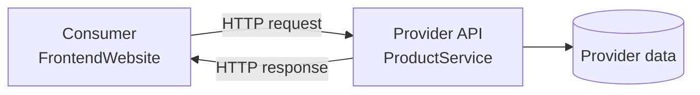

# PHẦN C — CONTRACT TESTING

Vấn đề · Giải pháp · Pact Framework

---

06 · The Problem

# Khi mỗi service đều **"xanh"**... hệ thống vẫn có thể **"đỏ"**

  

  
Consumer1

  
Kỳ vọng field <code>product.name</code>, nhưng Provider đổi thành <code>displayName</code>

  

  

  
Provider2

  
Unit test vẫn pass — logic và schema mới đều đúng theo góc nhìn backend

  

  

  
Runtime

  
Lỗi chỉ lộ khi tích hợp — trên staging hoặc production

  

  
"Hai phía có còn hiểu cùng một giao thức hay không?"

  
Unit test kiểm tra logic nội bộ — không kiểm chứng giả định xuyên biên giới

1<strong>Consumer</strong> — Bên gọi API (vd: FrontendWebsite).

2<strong>Provider</strong> — Bên cung cấp API (vd: ProductService).

<!--
Motivation slide: unit test không đủ.
-->

---

06 · Definition

# Contract Testing là gì?

  

  

      Contract1 là đặc tả <strong>có thể thực thi</strong> về những request Consumer gửi và response Provider cam kết đáp ứng.
  

  <v-clicks>

  - **Request:** method, path, query, headers, body
  - **Response:** status, headers, schema và matching rules
  - **Context:** provider state2 — điều kiện trước của interaction3

  </v-clicks>
  

  

  
INTERACTION

  

      Given product 10 exists 
      When GET /product/10 
      Then 200 + Product schema
  

  

  Contract Testing xác minh <strong class="text-cyan-700">tính tương thích</strong> — không chứng minh toàn bộ nghiệp vụ đúng.

1<strong>Contract</strong> — Bản cam kết bằng máy về cách hai bên giao tiếp.

2<strong>Provider state</strong> — Điều kiện dữ liệu cần có trước khi chạy interaction (vd: "product 10 exists").

3<strong>Interaction</strong> — Một cặp request–response cụ thể trong contract.

<!--
Contract = đặc tả có thể thực thi.
-->

---

06 · Comparison

# So sánh các lớp kiểm thử

  <table class="w-full text-sm">
  <thead>
      <tr class="border-b-2 border-cyan-200">
        <th class="text-left py-2 text-cyan-700">Tiêu chí</th>
        <th class="text-left py-2 text-cyan-700">API Testing</th>
        <th class="text-left py-2 text-cyan-700">Contract Testing</th>
        <th class="text-left py-2 text-cyan-700">Integration1</th>
        <th class="text-left py-2 text-cyan-700">E2E2</th>
      </tr>
  </thead>
  <tbody>
      <tr v-click class="border-b border-gray-100"><td class="py-2 font-bold">Câu hỏi</td><td>Endpoint đúng?</td><td class="text-cyan-700 font-bold">Còn tương thích?</td><td>Phối hợp đúng?</td><td>Journey chạy?</td></tr>
      <tr v-click class="border-b border-gray-100"><td class="py-2 font-bold">Phạm vi</td><td>1+ endpoint</td><td>1 cặp C–P</td><td>Nhóm thành phần</td><td>Toàn hệ thống</td></tr>
      <tr v-click class="border-b border-gray-100"><td class="py-2 font-bold">Môi trường</td><td>API thật/mock</td><td>Cô lập, local/CI</td><td>Bán tích hợp</td><td>Gần production</td></tr>
      <tr v-click class="border-b border-gray-100"><td class="py-2 font-bold">Feedback</td><td>Nhanh–TB</td><td class="text-cyan-700 font-bold">Nhanh, rõ</td><td>Trung bình</td><td>Chậm</td></tr>
      <tr v-click class="border-b border-gray-100"><td class="py-2 font-bold">Điểm mạnh</td><td>Chức năng, auth</td><td>Chống breaking change</td><td>Wiring</td><td>User journey</td></tr>
      <tr v-click><td class="py-2 font-bold">Điểm mù</td><td>Phụ thuộc consumer</td><td>Business logic</td><td>Ngoài scope</td><td>Flaky, đắt</td></tr>
  </tbody>
  </table>

  Contract Test <strong>bổ sung</strong> Unit / Integration / E2E — không thay thế tất cả.

1<strong>Integration</strong> — Kiểm thử nhiều thành phần phối hợp với nhau.

2<strong>E2E</strong> — Kiểm thử toàn bộ hành trình người dùng qua nhiều service.

<!--
Dùng đúng lớp test cho đúng loại rủi ro.
-->

---

07 · Architecture

# Mô hình Consumer–Provider

  

  <strong class="text-cyan-700">Consumer (FrontendWebsite)</strong>
  
Mô tả chính xác phần API nó sử dụng → sinh Pact file (JSON)

  

  

  <strong class="text-blue-700">Provider (ProductService)</strong>
  
Chứng minh implementation đáp ứng mọi interaction → chạy verification

  

  <strong class="text-indigo-700">Pact Broker:1</strong> Lưu contract + version + kết quả verification → Compatibility matrix2 → <code>can-i-deploy</code> gate

1<strong>Pact Broker</strong> — Kho trung tâm lưu contract + kết quả verification.

2<strong>Compatibility matrix</strong> — Bảng tra cứu phiên bản Consumer nào tương thích phiên bản Provider nào.

<!--
Consumer-driven ≠ Consumer áp đặt.
-->

---

07 · Why Consumer-Driven?

# Consumer-Driven: Vì sao?

  

  <h3 class="text-lg font-bold text-red-600 mb-2">Provider-Driven</h3>
  

      Provider công bố toàn bộ schema. Consumer phải thích nghi. 
      <strong class="text-red-500">Vấn đề:</strong> Provider khó biết phần nào đang được sử dụng.
  

  

  

  <h3 class="text-lg font-bold text-green-600 mb-2">Consumer-Driven</h3>
  

      Mỗi Consumer phát hành interaction mình phụ thuộc. Provider xác minh tập hợp nhu cầu thực tế. 
      <strong class="text-green-600">Lợi ích:</strong> Provider biết field nào đang dùng → tránh xóa/sửa nhầm.
  

  

  

  1
  Consumer nêu nhu cầu
  

  
→

  

  2
  Provider xác minh
  

  
→

  

  3
  Hai đội cùng tiến hóa
  

<!--
Công cụ hỗ trợ cuộc hội thoại — không thay thế thiết kế API.
-->

---

07 · Limitations

# Giới hạn của Contract Testing

  

  <h3 class="font-bold text-red-600">Business logic nội bộ</h3>
  
Response đúng schema nhưng tính sai tổng tiền vẫn pass

  

  

  <h3 class="font-bold text-yellow-600">Hạ tầng production</h3>
  
DNS, TLS, gateway, timeout cần lớp test/monitor khác

  

  

  <h3 class="font-bold text-orange-600">Hành trình nhiều service</h3>
  
Một pact chỉ chứng minh một ranh giới

  

  

  <h3 class="font-bold text-purple-600">Chất lượng API design</h3>
  
Tương thích ≠ dễ dùng, nhất quán, an toàn

  

  <strong>Unit</strong> → logic · <strong class="text-cyan-700">Contract</strong> → compatibility · <strong>Integration</strong> → wiring · <strong>E2E</strong> → critical journeys

<!--
Contract test là một lớp bảo vệ có scope rõ ràng.
-->

