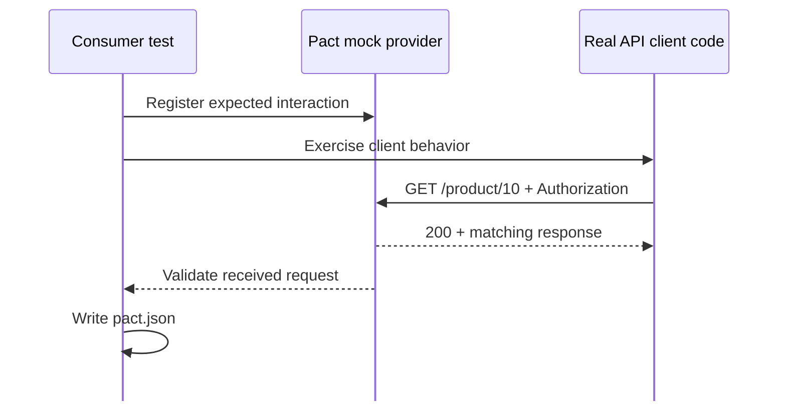
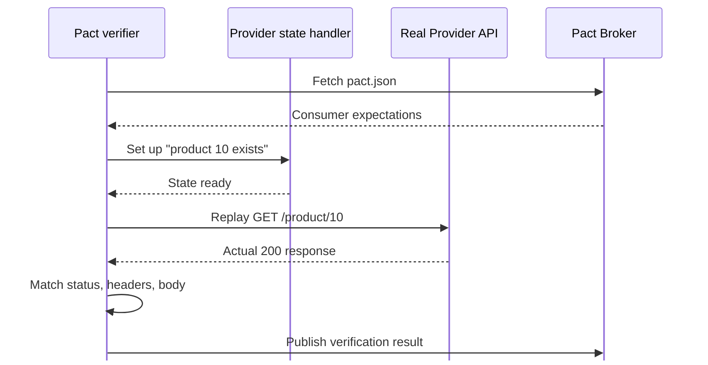
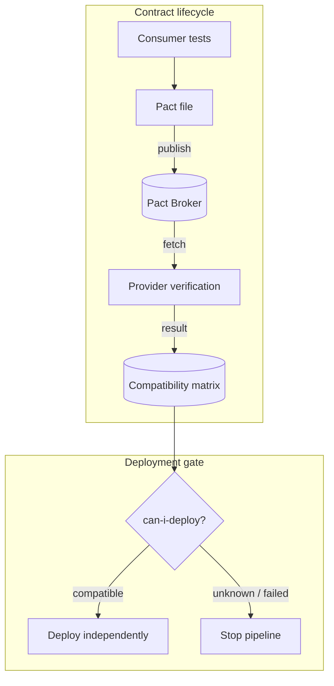

# PHẦN D — DEMO PACT

<div class="text-lg text-gray-400 mt-4">Consumer → Provider → Broker → Breaking Change</div>

---

<div class="text-sm font-mono tracking-widest text-cyan-600 uppercase mb-4">08 · Consumer Side</div>

# Bước 1 — Consumer **tạo contract**



<div v-click class="mt-4 p-3 bg-cyan-50 border border-cyan-200 rounded-lg text-sm">
  Mock Provider không thay thế code Consumer — test phải gọi <strong>API client thật</strong> của Consumer.
</div>

<!--
Consumer test vừa kiểm tra client, vừa ghi lại response tối thiểu.
-->

---

<div class="text-sm font-mono tracking-widest text-cyan-600 uppercase mb-4">08 · Contract Anatomy</div>

# Pact JSON — Cấu trúc Interaction

```json {2-4,7-12|14-18|all}
{
  "description": "get product 10",
  "providerState": "product 10 exists",
  "request": {
    "method": "GET",
    "path": "/product/10"
  },
  "response": {
    "status": 200,
    "body": {
      "id": "10",
      "name": "28 Degrees",
      "type": "CREDIT_CARD"
    }
  },
  "matchingRules": {
    "$.body.id": "type:string",
    "$.body.name": "type:string"
  }
}
```

<div v-click class="mt-4 p-3 bg-gray-50 border border-gray-200 rounded-lg text-sm">
  <strong>Nguyên tắc Matcher:</strong> Strict với điều Consumer phụ thuộc · Linh hoạt với dữ liệu động · Không over/under-specify
  <div class="text-xs text-gray-400 mt-1">Repo: 10 interactions · 10 Authorization regex matchers (Bearer ISO-8601)</div>
</div>

<!--
Click 1: provider state + request/response. Click 2: matching rules.
-->

---

<div class="text-sm font-mono tracking-widest text-cyan-600 uppercase mb-4">08 · Provider Side</div>

# Bước 2 — Provider **xác minh contract**



<div class="grid grid-cols-3 gap-3 mt-3 text-sm">
  <div v-click class="p-3 bg-cyan-50 border border-cyan-200 rounded-lg"><strong class="text-cyan-700">Real routing</strong><br>Request đi vào API thật</div>
  <div v-click class="p-3 bg-blue-50 border border-blue-200 rounded-lg"><strong class="text-blue-700">Controlled state</strong><br>Dữ liệu test có thể tái tạo</div>
  <div v-click class="p-3 bg-indigo-50 border border-indigo-200 rounded-lg"><strong class="text-indigo-700">Precise diff</strong><br>Mismatch chỉ rõ field bị gãy</div>
</div>

<!--
Provider verification KHÔNG gọi Consumer. Verifier đóng vai Consumer.
-->

---

<div class="text-sm font-mono tracking-widest text-cyan-600 uppercase mb-4">08 · Broker & CI/CD</div>

# Broker & Deployment Gate



<div v-click class="mt-4 p-3 bg-cyan-50 border border-cyan-200 rounded-lg text-sm text-center">
  Broker liên kết <strong>version Consumer</strong> + <strong>version Provider</strong> + <strong>kết quả verification</strong> → Compatibility matrix
</div>

<!--
Broker = registry + compatibility matrix.
-->

---

<div class="text-sm font-mono tracking-widest text-cyan-600 uppercase mb-4">08 · Case Study</div>

# Case Study: Product Service

<div class="grid grid-cols-2 gap-8 mt-4">
  <div>
  <h3 class="text-lg font-bold text-cyan-700 mb-3">Bộ contract (10 interactions)</h3>

| Nhóm API | Số | Trạng thái |
|----------|:---:|---|
| GET /products | 2 | Có dữ liệu + danh sách rỗng |
| GET /product/:id | 2 | Tồn tại + không tồn tại |
| POST /products | 2 | Tạo thành công + validation error |
| PUT /product/:id | 2 | Cập nhật + không tồn tại |
| DELETE /product/:id | 2 | Xóa thành công + không tồn tại |

  </div>
  <div>
  <h3 class="text-lg font-bold text-blue-700 mb-3">Kết quả</h3>
  <div class="grid grid-cols-2 gap-4">
      <div class="p-4 bg-green-50 border border-green-200 rounded-xl text-center">
        <div class="text-3xl font-bold text-green-600">10/10</div>
        <div class="text-sm text-gray-500">Consumer interactions pass</div>
      </div>
      <div class="p-4 bg-green-50 border border-green-200 rounded-xl text-center">
        <div class="text-3xl font-bold text-green-600">✓</div>
        <div class="text-sm text-gray-500">Provider verification pass</div>
      </div>
  </div>

  <h3 class="text-lg font-bold text-indigo-700 mt-6 mb-3">Lệnh chạy</h3>

```bash
# Consumer test
npm run test:pact --prefix .../consumer

# Provider verification
npm run test:pact --prefix .../provider
```

  </div>
</div>

<!--
Consumer: FrontendWebsite. Provider: ProductService.
-->

---

<div class="text-sm font-mono tracking-widest text-cyan-600 uppercase mb-4">08 · Breaking Change</div>

# Breaking Change Demo

<div class="grid grid-cols-2 gap-8 mt-6">
  <div>
  <h3 class="text-lg font-bold text-red-600 mb-3">Kịch bản</h3>
  <v-clicks>

  - Provider đổi field `name` → `title` trong response
  - HTTP status vẫn **200** — API "có vẻ" hoạt động
  - Nhưng Consumer contract yêu cầu field **`name`**

  </v-clicks>

  <h3 class="text-lg font-bold text-red-600 mt-6 mb-3">Kết quả</h3>
  <v-clicks>

  - Provider verification **FAIL** — thiếu field `name`
  - Pact chỉ rõ mismatch: expected `name`, got `title`
  - Khôi phục `name` → verification **PASS** trở lại

  </v-clicks>
  </div>
  <div>
  <div class="p-5 bg-red-50 border-2 border-red-300 rounded-xl">
      <div class="text-sm font-bold text-red-600 mb-3">BÀI HỌC</div>
      <div class="text-sm text-gray-700 space-y-2">
        <div>Đổi tên field là <strong>breaking change</strong> dù HTTP status không đổi.</div>
        <div>Functional test có thể <strong>không phát hiện</strong> nếu không assert đúng field.</div>
        <div>Contract test phát hiện <strong class="text-red-600">ngay tại provider verification</strong>.</div>
      </div>
  </div>
  </div>
</div>

<!--
Nội dung chính của Mini Exercise phần C.
-->

