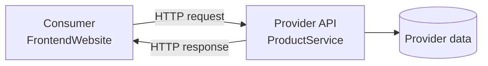

<!-- Slide 29 -->

07 · Architecture

# Mô hình Consumer–Provider

  

  <strong class="text-cyan-700">Consumer (FrontendWebsite)</strong>
  
Mô tả chính xác phần API nó sử dụng → sinh Pact file (JSON)

  

  

  <strong class="text-blue-700">Provider (ProductService)</strong>
  
Chứng minh implementation đáp ứng mọi interaction → chạy verification

  

  <strong class="text-indigo-700">Pact Broker:1</strong> Lưu contract + version + kết quả verification → Compatibility matrix2 → <code>can-i-deploy</code> gate

1<strong>Pact Broker</strong> — Kho trung tâm lưu contract + kết quả verification.

2<strong>Compatibility matrix</strong> — Bảng tra cứu phiên bản Consumer nào tương thích phiên bản Provider nào.

<!--
Consumer-driven ≠ Consumer áp đặt.
-->