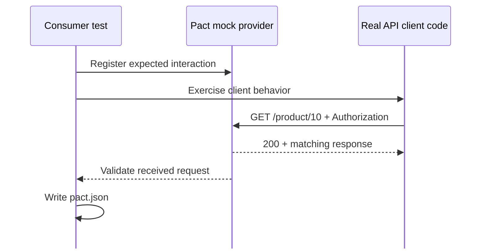

<!-- Slide 28 -->

08 · Consumer Side

# Bước 1 — Consumer **tạo contract**

  Mock Provider1 không thay thế code Consumer — test phải gọi <strong>API client thật</strong> của Consumer.

1<strong>Mock provider</strong> — Server giả do Pact dựng lên để Consumer test chạy mà không cần Provider thật.

<!--
Consumer test vừa kiểm tra client, vừa ghi lại response tối thiểu.
-->