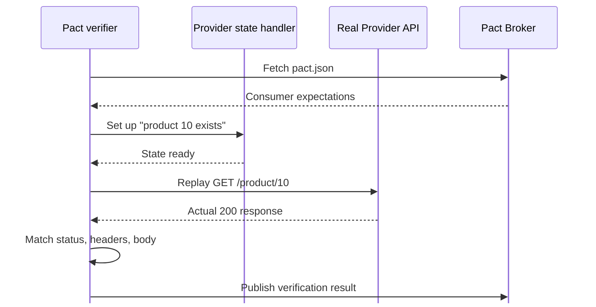

<!-- Slide 35 -->

08 · Provider Side

# Bước 2 — Provider **xác minh contract**1

  
<strong class="text-cyan-700">Real routing</strong> Request đi vào API thật

  
<strong class="text-blue-700">Controlled state</strong> Dữ liệu test có thể tái tạo

  
<strong class="text-indigo-700">Precise diff</strong> Mismatch chỉ rõ field bị gãy

1<strong>Verifier</strong> — Công cụ Pact chạy phía Provider, replay từng request trong contract.

<!--
Provider verification KHÔNG gọi Consumer. Verifier đóng vai Consumer.
-->