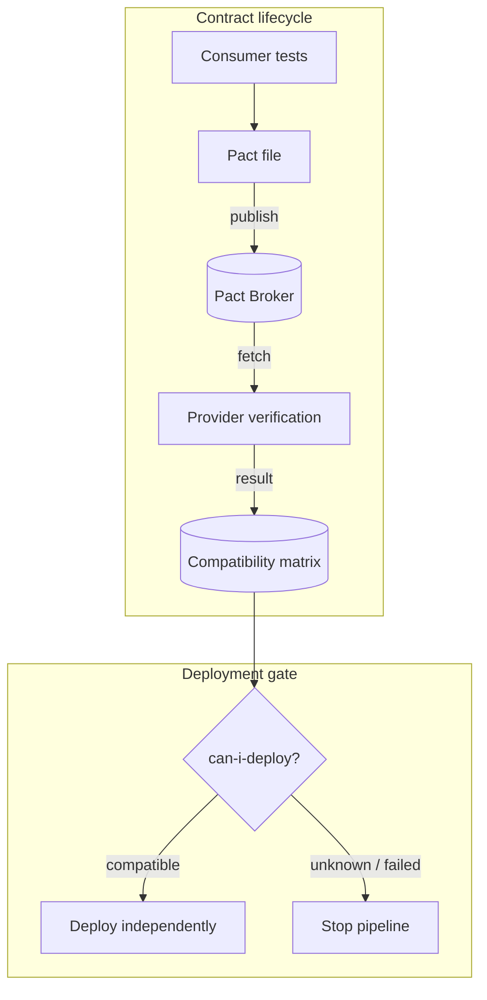

<!-- Slide 31 -->

08 · Broker & CI/CD

# Broker & Deployment Gate1

  Broker liên kết <strong>version Consumer</strong> + <strong>version Provider</strong> + <strong>kết quả verification</strong> → Compatibility matrix

1<strong>Deployment gate</strong> — Điểm kiểm soát quyết định có được deploy hay không.

<!--
Broker = registry + compatibility matrix.
-->