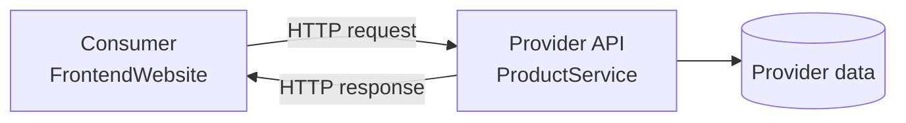
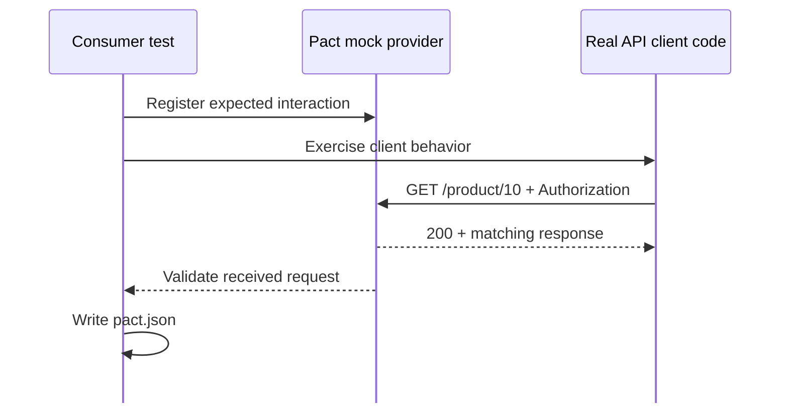
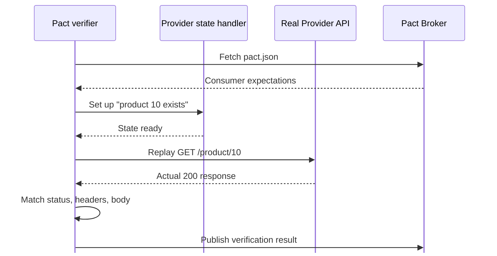
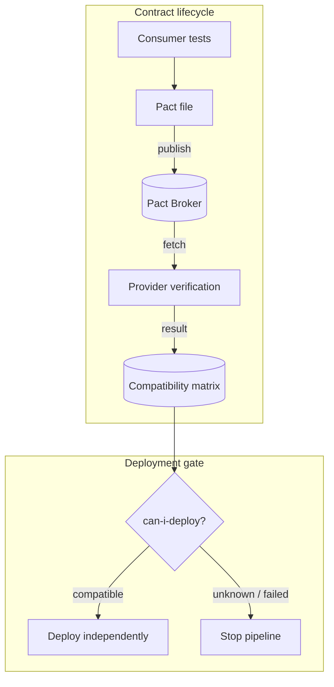

<div class="text-center mt-16">
  <div class="text-sm font-mono tracking-widest text-cyan-600 uppercase mb-4">Software Testing Seminar</div>
  <h1 class="text-6xl font-bold leading-tight">
  <span class="text-cyan-600">API Testing</span> &<br><span class="text-blue-600">Contract Testing</span>
  </h1>
  <div class="mt-8 text-xl text-gray-500">Nhóm 03 — SEBros</div>
</div>

<div class="mt-10 flex justify-center gap-6">
  <div class="px-4 py-2 bg-cyan-50 border border-cyan-200 rounded-lg text-sm text-cyan-700">Postman</div>
  <div class="px-4 py-2 bg-blue-50 border border-blue-200 rounded-lg text-sm text-blue-700">Newman</div>
  <div class="px-4 py-2 bg-indigo-50 border border-indigo-200 rounded-lg text-sm text-indigo-700">Pact</div>
  <div class="px-4 py-2 bg-emerald-50 border border-emerald-200 rounded-lg text-sm text-emerald-700">GitHub Actions</div>
</div>

<!--
Trang bìa — giới thiệu tên đề tài và nhóm.
-->

---
layout: center
---

<div class="text-sm font-mono tracking-widest text-cyan-600 uppercase mb-4">Agenda</div>

# Nội dung trình bày

<div class="grid grid-cols-2 gap-x-12 gap-y-3 mt-8 text-lg">
  <div v-click class="flex items-start gap-3">
  <span class="text-cyan-600 font-bold">01</span>
  <span>Giới thiệu & Mục tiêu</span>
  </div>
  <div v-click class="flex items-start gap-3">
  <span class="text-cyan-600 font-bold">02</span>
  <span>API Testing — Khái niệm & Kỹ thuật</span>
  </div>
  <div v-click class="flex items-start gap-3">
  <span class="text-cyan-600 font-bold">03</span>
  <span>Công cụ: Postman & REST Client</span>
  </div>
  <div v-click class="flex items-start gap-3">
  <span class="text-cyan-600 font-bold">04</span>
  <span>Demo: API Testing thực hành</span>
  </div>
  <div v-click class="flex items-start gap-3">
  <span class="text-cyan-600 font-bold">05</span>
  <span>Automation với Newman & CI/CD</span>
  </div>
  <div v-click class="flex items-start gap-3">
  <span class="text-cyan-600 font-bold">06</span>
  <span>Contract Testing — Vấn đề & Giải pháp</span>
  </div>
  <div v-click class="flex items-start gap-3">
  <span class="text-cyan-600 font-bold">07</span>
  <span>Pact: Consumer → Provider → Broker</span>
  </div>
  <div v-click class="flex items-start gap-3">
  <span class="text-cyan-600 font-bold">08</span>
  <span>Demo: Contract Testing & Breaking Change</span>
  </div>
  <div v-click class="flex items-start gap-3">
  <span class="text-cyan-600 font-bold">09</span>
  <span>AI hỗ trợ kiểm thử</span>
  </div>
  <div v-click class="flex items-start gap-3">
  <span class="text-cyan-600 font-bold">10</span>
  <span>Tổng kết & Q&A</span>
  </div>
</div>

<!--
Agenda 10 mục. Seminar gồm 3 video + 90 phút thực hành tại lớp.
-->

---

<div class="text-sm font-mono tracking-widest text-cyan-600 uppercase mb-4">01 · Introduction</div>

# Giới thiệu & Mục tiêu

<div class="grid grid-cols-2 gap-8 mt-6">
  <div>
  <h3 class="text-lg font-bold text-cyan-700 mb-3">Bối cảnh</h3>
  <v-clicks>

  - Hệ thống hiện đại chia thành nhiều **service độc lập** (microservices)
  - Mỗi service có API riêng → cần kiểm thử ở **nhiều lớp**
  - Kiểm thử thủ công không đủ → cần **automation & CI/CD**

  </v-clicks>
  </div>
  <div>
  <h3 class="text-lg font-bold text-blue-700 mb-3">Mục tiêu seminar</h3>
  <v-clicks>

  - Hiểu và thực hành **API Testing** (functional testing tầng API)
  - Hiểu và thực hành **Contract Testing** (tương thích Consumer–Provider)
  - Tự động hóa bằng **Newman + GitHub Actions**
  - Trải nghiệm quy trình **AI-assisted testing**

  </v-clicks>
  </div>
</div>

<div v-click class="mt-6 p-4 bg-gray-50 border border-gray-200 rounded-lg text-sm">
  <strong class="text-cyan-700">Phạm vi:</strong> Product Service API (Node.js/Express) — CRUD 5 endpoints · Postman, Newman, Pact, GitHub Actions
</div>

<!--
Bối cảnh microservices → cần kiểm thử nhiều lớp.
-->

---
layout: section
---

# PHẦN A — API TESTING

<div class="text-lg text-gray-400 mt-4">Khái niệm · Kỹ thuật · Công cụ · Demo</div>

---

<div class="text-sm font-mono tracking-widest text-cyan-600 uppercase mb-4">02 · API Basics</div>

# API là gì?

**API** (Application Programming Interface): giao diện lập trình cho phép các hệ thống giao tiếp.

**REST API**: dùng HTTP protocol — method, URL, headers, body.

<div class="mt-6 p-4 bg-gray-50 border border-gray-200 rounded-lg font-mono text-sm">
  <div class="text-gray-500">Request: <span class="text-cyan-700">Method + URL + Headers + Body</span></div>
  <div class="text-gray-500 mt-1">Response: <span class="text-blue-700">Status Code + Headers + Body</span></div>
</div>

<div class="grid grid-cols-2 gap-8 mt-6">
  <div>
  <h3 class="text-lg font-bold text-cyan-700 mb-3">HTTP Methods</h3>

| Method | Ý nghĩa | Ví dụ |
|--------|----------|-------|
| `GET` | Đọc dữ liệu | `GET /products` |
| `POST` | Tạo mới | `POST /products` |
| `PUT` | Cập nhật toàn bộ | `PUT /product/10` |
| `DELETE` | Xóa | `DELETE /product/10` |

  </div>
  <div>
  <h3 class="text-lg font-bold text-blue-700 mb-3">HTTP Status Codes</h3>

| Mã | Ý nghĩa |
|----|----------|
| `200` | OK — thành công |
| `201` | Created — tạo mới thành công |
| `204` | No Content — xóa thành công |
| `400` | Bad Request — dữ liệu không hợp lệ |
| `401` | Unauthorized — thiếu/sai token |
| `404` | Not Found — không tồn tại |

  </div>
</div>

<!--
Nhắc lại kiến thức nền: API, REST, HTTP methods và status codes.
-->

---

<div class="text-sm font-mono tracking-widest text-cyan-600 uppercase mb-4">02 · Authentication</div>

# API có Authentication vs Không

<div class="grid grid-cols-2 gap-8 mt-6">
  <div>
  <h3 class="text-lg font-bold text-gray-600 mb-3">Không authenticate</h3>
  <v-clicks>

  - Truy cập tự do, không cần token
  - Ví dụ: public API thời tiết, health check endpoint

  </v-clicks>
  </div>
  <div>
  <h3 class="text-lg font-bold text-cyan-700 mb-3">Có authenticate (Token-based)</h3>
  <v-clicks>

  - Yêu cầu header: `Authorization: Bearer <token>`
  - Token có thể là JWT, OAuth2, hoặc custom (ISO-8601)
  - Thiếu/sai/hết hạn token → `401 Unauthorized`

  </v-clicks>
  </div>
</div>

<div v-click class="mt-6 p-4 bg-cyan-50 border border-cyan-200 rounded-lg">
  <strong class="text-cyan-700">Ví dụ trong Product Service:</strong>
  <div class="mt-2 font-mono text-sm bg-white p-3 rounded border border-cyan-100">
    Authorization: Bearer 2026-07-15T10:00:00.000Z
  </div>
  <div class="mt-2 text-sm text-gray-600">
    Timestamp phải trong vòng <strong>1 giờ</strong> so với server · Sai định dạng hoặc hết hạn → <code>401</code>
  </div>
</div>

<!--
Test API phải bao gồm cả test authentication — không chỉ happy path.
-->

---

<div class="text-sm font-mono tracking-widest text-cyan-600 uppercase mb-4">02 · Test Design</div>

# Các loại Test Case cho API

<div class="mt-6">
  <table class="w-full text-sm">
  <thead>
      <tr class="border-b-2 border-cyan-200">
        <th class="text-left py-2 text-cyan-700">Loại</th>
        <th class="text-left py-2 text-cyan-700">Mô tả</th>
        <th class="text-left py-2 text-cyan-700">Ví dụ</th>
      </tr>
  </thead>
  <tbody>
      <tr v-click class="border-b border-gray-100"><td class="py-2 font-bold">Happy Path</td><td>Request hợp lệ → response đúng</td><td class="text-gray-500">GET /product/10 + valid token → 200</td></tr>
      <tr v-click class="border-b border-gray-100"><td class="py-2 font-bold">Negative</td><td>Input sai → xử lý lỗi đúng</td><td class="text-gray-500">GET /product/99999 → 404</td></tr>
      <tr v-click class="border-b border-gray-100"><td class="py-2 font-bold">Authentication</td><td>Thiếu/sai/hết hạn token → 401</td><td class="text-gray-500">Không gửi Authorization header</td></tr>
      <tr v-click class="border-b border-gray-100"><td class="py-2 font-bold">Validation</td><td>Body thiếu field → 400</td><td class="text-gray-500">POST thiếu "name" → 400</td></tr>
      <tr v-click class="border-b border-gray-100"><td class="py-2 font-bold">Schema</td><td>Response đúng cấu trúc kỳ vọng</td><td class="text-gray-500">Body có đủ id, type, name, version</td></tr>
      <tr v-click><td class="py-2 font-bold">Boundary</td><td>Giá trị biên</td><td class="text-gray-500">Token đúng 1 giờ trước (vừa hết hạn)</td></tr>
  </tbody>
  </table>
</div>

<div v-click class="mt-4 text-sm text-gray-500">
  <strong>Kỹ thuật:</strong> Domain Partitioning · Boundary Value Analysis · State Transition
</div>

<!--
6 loại test case. Kỹ thuật: Domain Partitioning, Boundary Value Analysis.
-->

---

<div class="text-sm font-mono tracking-widest text-cyan-600 uppercase mb-4">03 · Postman</div>

# Postman — Tổng quan

<div class="grid grid-cols-2 gap-8 mt-6">
  <div>
  <h3 class="text-lg font-bold text-cyan-700 mb-3">Postman là gì</h3>
  <v-clicks>

  - Nền tảng kiểm thử API **phổ biến nhất**
  - GUI trực quan + hỗ trợ **automation**
  - Miễn phí cho cá nhân

  </v-clicks>

  <h3 class="text-lg font-bold text-blue-700 mt-6 mb-3">Các khái niệm chính</h3>

  <v-clicks>

  - **Collection** — Gom nhóm request theo chức năng
  - **Environment** — Bộ biến môi trường (baseUrl, token...)
  - **Variable** — Giá trị động dùng lại
  - **Pre-request Script** — Chạy trước mỗi request
  - **Test Script** — Assertion kiểm tra response

  </v-clicks>
  </div>
  <div>
  <h3 class="text-lg font-bold text-indigo-700 mb-3">Tính năng nâng cao</h3>
  <v-clicks>

  - **Collection Runner** — Chạy nhiều request liên tiếp
  - **Data-driven** — Chạy 1 request với nhiều bộ dữ liệu (CSV/JSON)
  - **Newman** — CLI runner cho CI/CD
  - **Monitor** — Chạy test định kỳ
  - **Mock Server** — Giả lập API

  </v-clicks>
  </div>
</div>

<!--
Postman: GUI + automation. Các khái niệm: Collection, Environment, Variable, Scripts.
-->

---

<div class="text-sm font-mono tracking-widest text-cyan-600 uppercase mb-4">03 · Collection Structure</div>

# Postman — Tổ chức Collection

<div class="mt-6 p-4 bg-gray-50 border border-gray-200 rounded-lg font-mono text-sm leading-7">
  <div class="text-gray-700 font-bold">Product Service — Data Driven Tests</div>
  <div class="text-gray-500">├── <span class="text-cyan-600">_Setup (Pre-flight)</span>          ← sinh token</div>
  <div class="text-gray-500">├── <span class="text-green-600">GET — Happy Path</span>            ← 4 iterations</div>
  <div class="text-gray-500">├── <span class="text-red-500">GET — Negative</span>              ← 7 iterations</div>
  <div class="text-gray-500">├── <span class="text-green-600">POST — Happy Path</span>           ← 2 iterations</div>
  <div class="text-gray-500">├── <span class="text-red-500">POST — Negative</span>             ← 5 iterations</div>
  <div class="text-gray-500">├── <span class="text-green-600">PUT — Happy Path</span>            ← 2 iterations</div>
  <div class="text-gray-500">├── <span class="text-red-500">PUT — Negative</span>              ← 4 iterations</div>
  <div class="text-gray-500">├── <span class="text-green-600">DELETE — Happy Path</span>         ← 1 iteration</div>
  <div class="text-gray-500">└── <span class="text-red-500">DELETE — Negative</span>           ← 4 iterations</div>
</div>

<div class="grid grid-cols-3 gap-4 mt-4">
  <div v-click class="p-3 bg-cyan-50 border border-cyan-200 rounded-lg text-center">
  <div class="text-2xl font-bold text-cyan-700">29</div>
  <div class="text-xs text-gray-500">Test cases</div>
  </div>
  <div v-click class="p-3 bg-blue-50 border border-blue-200 rounded-lg text-center">
  <div class="text-2xl font-bold text-blue-700">5</div>
  <div class="text-xs text-gray-500">Endpoints</div>
  </div>
  <div v-click class="p-3 bg-indigo-50 border border-indigo-200 rounded-lg text-center">
  <div class="text-2xl font-bold text-indigo-700">9</div>
  <div class="text-xs text-gray-500">Folders</div>
  </div>
</div>

<!--
Tách theo HTTP method. Tách Happy Path / Negative riêng.
-->

---

<div class="text-sm font-mono tracking-widest text-cyan-600 uppercase mb-4">03 · Scripts</div>

# Postman — Script & Assertion

<div class="grid grid-cols-2 gap-6 mt-4">
  <div>
  <h3 class="text-base font-bold text-cyan-700 mb-2">Pre-request Script (Collection level)</h3>
  <div class="text-sm text-gray-600 mb-2">Tự động sinh Bearer token hợp lệ mỗi iteration:</div>
  <div class="text-xs text-gray-500">
      - `"{{validToken}}"` → Bearer hợp lệ<br>
      - `"Bearer 2020-..."` → token hết hạn (negative)<br>
      - `""` → xóa header (no token case)
  </div>
  </div>
  <div>
  <h3 class="text-base font-bold text-blue-700 mb-2">Test Script (ví dụ)</h3>

```javascript
pm.test("Status is 200", () => {
    pm.response.to.have.status(200);
});

pm.test("Response has required fields", () => {
    const json = pm.response.json();
    pm.expect(json).to.have.property("id");
    pm.expect(json).to.have.property("name");
    pm.expect(json).to.have.property("type");
});
```

  </div>
</div>

<!--
Pre-request script sinh token. Test script assert status + schema.
-->

---

<div class="text-sm font-mono tracking-widest text-cyan-600 uppercase mb-4">03 · Data-driven</div>

# Data-driven Testing

**Khái niệm:** Chạy cùng 1 request với **nhiều bộ dữ liệu** khác nhau. Data file: JSON hoặc CSV. Mỗi dòng = 1 iteration.

```json
{
  "tc_id": "GET_ID_01",
  "description": "Existing product with valid token",
  "product_id": "10",
  "auth_header": "{{validToken}}",
  "expected_status": 200,
  "expect_field_id": "10",
  "expect_field_name": "28 Degrees"
}
```

<div class="grid grid-cols-3 gap-4 mt-6">
  <div v-click class="p-3 bg-cyan-50 border border-cyan-200 rounded-lg">
  <strong class="text-cyan-700">Tách logic khỏi data</strong>
  <div class="text-sm text-gray-500 mt-1">Script không đổi, chỉ thêm data</div>
  </div>
  <div v-click class="p-3 bg-blue-50 border border-blue-200 rounded-lg">
  <strong class="text-blue-700">Dễ thêm case mới</strong>
  <div class="text-sm text-gray-500 mt-1">Thêm dòng vào data file</div>
  </div>
  <div v-click class="p-3 bg-indigo-50 border border-indigo-200 rounded-lg">
  <strong class="text-indigo-700">Phù hợp automation</strong>
  <div class="text-sm text-gray-500 mt-1">Chạy với Newman CI/CD</div>
  </div>
</div>

<!--
Data-driven: tách test logic khỏi test data.
-->

---

<div class="text-sm font-mono tracking-widest text-cyan-600 uppercase mb-4">03 · Alternative</div>

# VS Code REST Client

<div class="grid grid-cols-2 gap-8 mt-4">
  <div>
  <h3 class="text-lg font-bold text-cyan-700 mb-3">REST Client (extension)</h3>
  <v-clicks>

  - File `.http` — viết request ngay trong VS Code
  - Không cần mở Postman GUI
  - Hỗ trợ biến, chaining, assertion cơ bản

  </v-clicks>

  <div class="mt-4 p-3 bg-gray-50 border border-gray-200 rounded-lg font-mono text-sm">

```http
@baseUrl = http://localhost:8080
@token = {{$datetime iso8601 -1 m}}

### GET /products → 200
GET {{baseUrl}}/products
Authorization: Bearer {{token}}
```

  </div>
  </div>
  <div>
  <h3 class="text-lg font-bold text-blue-700 mb-3">So sánh nhanh</h3>

| Tiêu chí | Postman | REST Client |
|----------|---------|-------------|
| GUI | Đầy đủ | Tối giản |
| Data-driven | ✅ | ❌ |
| Script | JS đầy đủ | Hạn chế |
| CI/CD | Export → Newman | ❌ |
| Tiện lợi | Cần mở app | Ngay trong editor |

  </div>
</div>

<!--
REST Client phù hợp dev test nhanh; Postman phù hợp test suite đầy đủ.
-->

---

<div class="text-sm font-mono tracking-widest text-cyan-600 uppercase mb-4">04 · Sample API</div>

# API mẫu: Product Service

<div class="grid grid-cols-2 gap-8 mt-4">
  <div>
  <h3 class="text-lg font-bold text-cyan-700 mb-3">Thông tin</h3>
  <v-clicks>

  - **Node.js + Express**
  - Port: `8080`
  - Auth: **Bearer ISO-8601** (trong vòng 1 giờ)
  - Data: **In-memory** (reset khi restart)

  </v-clicks>

  <h3 class="text-lg font-bold text-blue-700 mt-6 mb-3">Product Schema</h3>

```json
{
  "id": "10",
  "type": "CREDIT_CARD",
  "name": "28 Degrees",
  "version": "v1"
}
```

  </div>
  <div>
  <h3 class="text-lg font-bold text-indigo-700 mb-3">Endpoints</h3>

| Method | Path | Success | Error |
|--------|------|---------|-------|
| `GET` | `/products` | 200 + array | 401 |
| `GET` | `/product/:id` | 200 + object | 401, 404 |
| `POST` | `/products` | 201 + created | 400, 401 |
| `PUT` | `/product/:id` | 200 + updated | 401, 404 |
| `DELETE` | `/product/:id` | 204 | 401, 404 |

  </div>
</div>

<!--
Product Service: 5 endpoints CRUD, auth ISO-8601, in-memory data.
-->

---
layout: section
---

# PHẦN B — AUTOMATION & CI/CD

<div class="text-lg text-gray-400 mt-4">Newman · GitHub Actions · Pipeline</div>

---

<div class="text-sm font-mono tracking-widest text-cyan-600 uppercase mb-4">05 · Newman</div>

# Newman — CLI Runner

<div class="grid grid-cols-2 gap-8 mt-4">
  <div>
  <h3 class="text-lg font-bold text-cyan-700 mb-3">Newman là gì</h3>
  <v-clicks>

  - Command-line runner cho **Postman Collection**
  - Chạy test **không cần mở Postman GUI**
  - Xuất báo cáo: **CLI, HTML, JSON**

  </v-clicks>

  <h3 class="text-lg font-bold text-blue-700 mt-6 mb-3">Luồng tự động hóa</h3>
  <v-clicks>

  1. Khởi động Provider tại `localhost:8080`
  2. Readiness probe: gọi `/health`
  3. Chạy Newman với collection + environment
  4. Xuất báo cáo HTML + JSON
  5. Upload artifact (kể cả khi test fail)

  </v-clicks>
  </div>
  <div>
  <h3 class="text-lg font-bold text-indigo-700 mb-3">Lệnh cốt lõi</h3>

```bash
newman run collection.json \
  -e environment.json \
  --reporters cli,htmlextra,json \
  --reporter-htmlextra-export report.html \
  --reporter-json-export report.json
```

  </div>
</div>

<!--
Newman = CLI runner cho Postman Collection.
-->

---

<div class="text-sm font-mono tracking-widest text-cyan-600 uppercase mb-4">05 · CI/CD</div>

# GitHub Actions — Newman Pipeline

<div class="mt-4 p-3 bg-gray-50 border border-gray-200 rounded-lg font-mono text-sm">
  <span class="text-gray-500">Workflow:</span> <span class="text-cyan-700 font-bold">newman-api-test.yml</span>
  <span class="text-gray-400 mx-2">|</span>
  <span class="text-gray-500">Trigger:</span> <span class="text-blue-700">push/PR vào main + manual dispatch</span>
</div>

<div class="mt-4 p-4 bg-gray-50 border border-gray-200 rounded-lg font-mono text-sm leading-7">
  <div class="text-gray-600">Checkout → Setup Node 20 → Install deps → Start Provider</div>
  <div class="text-gray-600">→ Wait <span class="text-cyan-600">/health</span> (30s timeout) → Install Newman</div>
  <div class="text-gray-600">→ <span class="text-blue-600">Run Newman</span> → Upload report artifact</div>
</div>

<div class="grid grid-cols-2 gap-4 mt-4">
  <div v-click class="p-3 bg-cyan-50 border border-cyan-200 rounded-lg text-sm">
  <strong class="text-cyan-700">permissions: contents: read</strong>
  <div class="text-gray-500 text-xs mt-1">Giới hạn quyền tối thiểu</div>
  </div>
  <div v-click class="p-3 bg-blue-50 border border-blue-200 rounded-lg text-sm">
  <strong class="text-blue-700">timeout-minutes: 10</strong>
  <div class="text-gray-500 text-xs mt-1">Tránh pipeline treo</div>
  </div>
  <div v-click class="p-3 bg-indigo-50 border border-indigo-200 rounded-lg text-sm">
  <strong class="text-indigo-700">concurrency: cancel-in-progress</strong>
  <div class="text-gray-500 text-xs mt-1">Hủy run cũ khi push mới</div>
  </div>
  <div v-click class="p-3 bg-emerald-50 border border-emerald-200 rounded-lg text-sm">
  <strong class="text-emerald-700">if: always()</strong>
  <div class="text-gray-500 text-xs mt-1">Luôn upload report để debug</div>
  </div>
</div>

<!--
Không cần secret vì token do Pre-request script tự sinh.
-->

---

<div class="text-sm font-mono tracking-widest text-cyan-600 uppercase mb-4">05 · CI/CD</div>

# GitHub Actions — Pact Pipeline

<div class="mt-4 p-3 bg-gray-50 border border-gray-200 rounded-lg font-mono text-sm">
  <span class="text-gray-500">Workflow:</span> <span class="text-cyan-700 font-bold">pact-verification.yml</span>
</div>

<div class="mt-6 flex items-center justify-center gap-4">
  <div class="p-4 bg-cyan-50 border-2 border-cyan-300 rounded-xl text-center w-56">
  <div class="text-sm font-bold text-cyan-700">Consumer Pact</div>
  <div class="text-xs text-gray-500 mt-1">Sinh pact.json</div>
  <div class="text-xs text-gray-400 mt-1">npm run test:pact</div>
  </div>
  <div class="text-2xl text-gray-300">→</div>
  <div class="p-4 bg-blue-50 border-2 border-blue-300 rounded-xl text-center w-56">
  <div class="text-sm font-bold text-blue-700">Provider Verification</div>
  <div class="text-xs text-gray-500 mt-1">Verify pact thật</div>
  <div class="text-xs text-gray-400 mt-1">Chạy với API thật</div>
  </div>
  <div class="text-2xl text-gray-300">→</div>
  <div class="p-4 bg-indigo-50 border-2 border-indigo-300 rounded-xl text-center w-56">
  <div class="text-sm font-bold text-indigo-700">can-i-deploy</div>
  <div class="text-xs text-gray-500 mt-1">Quality gate</div>
  <div class="text-xs text-gray-400 mt-1">Chặn nếu incompatible</div>
  </div>
</div>

<div class="grid grid-cols-3 gap-4 mt-6 text-sm">
  <div v-click class="p-3 bg-gray-50 border border-gray-200 rounded-lg">
  <strong class="text-cyan-700">Job 1 — Consumer</strong>
  <div class="text-gray-500 text-xs mt-1">Chạy consumer test → sinh pact JSON → upload artifact → publish lên Broker</div>
  </div>
  <div v-click class="p-3 bg-gray-50 border border-gray-200 rounded-lg">
  <strong class="text-blue-700">Job 2 — Provider</strong>
  <div class="text-gray-500 text-xs mt-1">Download pact → chạy verifier với API thật → publish kết quả</div>
  </div>
  <div v-click class="p-3 bg-gray-50 border border-gray-200 rounded-lg">
  <strong class="text-indigo-700">Job 3 — can-i-deploy</strong>
  <div class="text-gray-500 text-xs mt-1">Kiểm tra compatibility matrix → chặn deploy nếu chưa tương thích</div>
  </div>
</div>

<!--
3 jobs nối tiếp: Consumer → Provider → can-i-deploy.
-->

---

<div class="text-sm font-mono tracking-widest text-cyan-600 uppercase mb-4">05 · Value</div>

# Giá trị của Automation

<div class="mt-6">
  <h3 class="text-lg font-bold text-cyan-700 mb-3">Hai lớp bảo vệ</h3>

| Lớp | Công cụ | Phát hiện |
|-----|---------|-----------|
| **Functional** | Newman/Postman | Lỗi chức năng, validation, auth, payload |
| **Compatibility** | Pact | Breaking change tại biên Consumer–Provider |

</div>

<div class="grid grid-cols-2 gap-4 mt-6">
  <div v-click class="p-4 bg-cyan-50 border border-cyan-200 rounded-lg">
  <strong class="text-cyan-700">Phản hồi sớm</strong>
  <div class="text-sm text-gray-500 mt-1">Chạy trên mỗi push/PR</div>
  </div>
  <div v-click class="p-4 bg-blue-50 border border-blue-200 rounded-lg">
  <strong class="text-blue-700">Tái lập</strong>
  <div class="text-sm text-gray-500 mt-1">Log + artifact lưu lại để debug</div>
  </div>
  <div v-click class="p-4 bg-indigo-50 border border-indigo-200 rounded-lg">
  <strong class="text-indigo-700">Giảm thủ công</strong>
  <div class="text-sm text-gray-500 mt-1">Không cần kiểm tra manual</div>
  </div>
  <div v-click class="p-4 bg-emerald-50 border border-emerald-200 rounded-lg">
  <strong class="text-emerald-700">Bằng chứng</strong>
  <div class="text-sm text-gray-500 mt-1">Reviewer truy ngược version, test result</div>
  </div>
</div>

<!--
Hai lớp bảo vệ: Functional (Newman) + Compatibility (Pact).
-->

---
layout: section
---

# PHẦN C — CONTRACT TESTING

<div class="text-lg text-gray-400 mt-4">Vấn đề · Giải pháp · Pact Framework</div>

---

<div class="text-sm font-mono tracking-widest text-cyan-600 uppercase mb-4">06 · The Problem</div>

# Khi mỗi service đều **"xanh"**... hệ thống vẫn có thể **"đỏ"**

<div class="grid grid-cols-3 gap-4 mt-8">
  <div v-click class="p-4 bg-red-50 border border-red-200 rounded-xl">
  <div class="text-2xl font-bold text-red-500 mb-2">Consumer</div>
  <div class="text-sm text-gray-600">Kỳ vọng field <code>product.name</code>, nhưng Provider đổi thành <code>displayName</code></div>
  </div>
  <div v-click class="p-4 bg-yellow-50 border border-yellow-200 rounded-xl">
  <div class="text-2xl font-bold text-yellow-600 mb-2">Provider</div>
  <div class="text-sm text-gray-600">Unit test vẫn pass — logic và schema mới đều đúng theo góc nhìn backend</div>
  </div>
  <div v-click class="p-4 bg-red-50 border border-red-200 rounded-xl">
  <div class="text-2xl font-bold text-red-500 mb-2">Runtime</div>
  <div class="text-sm text-gray-600">Lỗi chỉ lộ khi tích hợp — trên staging hoặc production</div>
  </div>
</div>

<div v-click class="mt-8 p-4 bg-cyan-50 border border-cyan-200 rounded-lg text-center">
  <div class="text-lg text-cyan-700 font-bold">"Hai phía có còn hiểu cùng một giao thức hay không?"</div>
  <div class="text-sm text-gray-500 mt-2">Unit test kiểm tra logic nội bộ — không kiểm chứng giả định xuyên biên giới</div>
</div>

<!--
Motivation slide: unit test không đủ.
-->

---

<div class="text-sm font-mono tracking-widest text-cyan-600 uppercase mb-4">06 · Definition</div>

# Contract Testing là gì?

<div class="grid grid-cols-5 gap-8 mt-6 items-start">
  <div class="col-span-3">
  <div class="p-4 bg-blue-50 border-l-4 border-blue-400 rounded-r-lg text-lg italic text-gray-700">
      Contract là đặc tả <strong>có thể thực thi</strong> về những request Consumer gửi và response Provider cam kết đáp ứng.
  </div>

  <v-clicks>

  - **Request:** method, path, query, headers, body
  - **Response:** status, headers, schema và matching rules
  - **Context:** provider state — điều kiện trước của interaction

  </v-clicks>
  </div>

  <div class="col-span-2 p-4 bg-gray-50 border border-gray-200 rounded-lg">
  <div class="text-xs font-mono text-cyan-600 mb-3 font-bold">INTERACTION</div>
  <div class="text-sm leading-7">
      <span class="text-gray-400">Given</span> product 10 exists<br>
      <span class="text-gray-400">When</span> GET /product/10<br>
      <span class="text-gray-400">Then</span> 200 + Product schema
  </div>
  </div>
</div>

<div v-click class="mt-6 text-sm text-gray-500">
  Contract Testing xác minh <strong class="text-cyan-700">tính tương thích</strong> — không chứng minh toàn bộ nghiệp vụ đúng.
</div>

<!--
Contract = đặc tả có thể thực thi.
-->

---

<div class="text-sm font-mono tracking-widest text-cyan-600 uppercase mb-4">06 · Comparison</div>

# So sánh các lớp kiểm thử

<div class="mt-4">
  <table class="w-full text-sm">
  <thead>
      <tr class="border-b-2 border-cyan-200">
        <th class="text-left py-2 text-cyan-700">Tiêu chí</th>
        <th class="text-left py-2 text-cyan-700">API Testing</th>
        <th class="text-left py-2 text-cyan-700">Contract Testing</th>
        <th class="text-left py-2 text-cyan-700">Integration</th>
        <th class="text-left py-2 text-cyan-700">E2E</th>
      </tr>
  </thead>
  <tbody>
      <tr v-click class="border-b border-gray-100"><td class="py-2 font-bold">Câu hỏi</td><td>Endpoint đúng?</td><td class="text-cyan-700 font-bold">Còn tương thích?</td><td>Phối hợp đúng?</td><td>Journey chạy?</td></tr>
      <tr v-click class="border-b border-gray-100"><td class="py-2 font-bold">Phạm vi</td><td>1+ endpoint</td><td>1 cặp C–P</td><td>Nhóm thành phần</td><td>Toàn hệ thống</td></tr>
      <tr v-click class="border-b border-gray-100"><td class="py-2 font-bold">Môi trường</td><td>API thật/mock</td><td>Cô lập, local/CI</td><td>Bán tích hợp</td><td>Gần production</td></tr>
      <tr v-click class="border-b border-gray-100"><td class="py-2 font-bold">Feedback</td><td>Nhanh–TB</td><td class="text-cyan-700 font-bold">Nhanh, rõ</td><td>Trung bình</td><td>Chậm</td></tr>
      <tr v-click class="border-b border-gray-100"><td class="py-2 font-bold">Điểm mạnh</td><td>Chức năng, auth</td><td>Chống breaking change</td><td>Wiring</td><td>User journey</td></tr>
      <tr v-click><td class="py-2 font-bold">Điểm mù</td><td>Phụ thuộc consumer</td><td>Business logic</td><td>Ngoài scope</td><td>Flaky, đắt</td></tr>
  </tbody>
  </table>
</div>

<div v-click class="mt-4 p-3 bg-cyan-50 border border-cyan-200 rounded-lg text-sm">
  Contract Test <strong>bổ sung</strong> Unit / Integration / E2E — không thay thế tất cả.
</div>

<!--
Dùng đúng lớp test cho đúng loại rủi ro.
-->

---

<div class="text-sm font-mono tracking-widest text-cyan-600 uppercase mb-4">07 · Architecture</div>

# Mô hình Consumer–Provider



<div class="grid grid-cols-2 gap-6 mt-4">
  <div v-click class="p-4 bg-cyan-50 border border-cyan-200 rounded-lg">
  <strong class="text-cyan-700">Consumer (FrontendWebsite)</strong>
  <div class="text-sm text-gray-600 mt-1">Mô tả chính xác phần API nó sử dụng → sinh Pact file (JSON)</div>
  </div>
  <div v-click class="p-4 bg-blue-50 border border-blue-200 rounded-lg">
  <strong class="text-blue-700">Provider (ProductService)</strong>
  <div class="text-sm text-gray-600 mt-1">Chứng minh implementation đáp ứng mọi interaction → chạy verification</div>
  </div>
</div>

<div v-click class="mt-4 p-3 bg-indigo-50 border border-indigo-200 rounded-lg text-sm">
  <strong class="text-indigo-700">Pact Broker:</strong> Lưu contract + version + kết quả verification → Compatibility matrix → <code>can-i-deploy</code> gate
</div>

<!--
Consumer-driven ≠ Consumer áp đặt.
-->

---

<div class="text-sm font-mono tracking-widest text-cyan-600 uppercase mb-4">07 · Why Consumer-Driven?</div>

# Consumer-Driven: Vì sao?

<div class="grid grid-cols-2 gap-6 mt-8">
  <div v-click class="p-5 bg-red-50 border border-red-200 rounded-xl">
  <h3 class="text-lg font-bold text-red-600 mb-2">Provider-Driven</h3>
  <div class="text-sm text-gray-600">
      Provider công bố toàn bộ schema. Consumer phải thích nghi.<br>
      <strong class="text-red-500">Vấn đề:</strong> Provider khó biết phần nào đang được sử dụng.
  </div>
  </div>
  <div v-click class="p-5 bg-green-50 border border-green-200 rounded-xl">
  <h3 class="text-lg font-bold text-green-600 mb-2">Consumer-Driven</h3>
  <div class="text-sm text-gray-600">
      Mỗi Consumer phát hành interaction mình phụ thuộc. Provider xác minh tập hợp nhu cầu thực tế.<br>
      <strong class="text-green-600">Lợi ích:</strong> Provider biết field nào đang dùng → tránh xóa/sửa nhầm.
  </div>
  </div>
</div>

<div class="mt-8 flex items-center justify-center gap-6">
  <div v-click class="flex items-center gap-2">
  <span class="w-8 h-8 bg-cyan-500 text-white rounded-full flex items-center justify-center font-bold text-sm">1</span>
  <span class="text-sm">Consumer nêu nhu cầu</span>
  </div>
  <div class="text-gray-300">→</div>
  <div v-click class="flex items-center gap-2">
  <span class="w-8 h-8 bg-blue-500 text-white rounded-full flex items-center justify-center font-bold text-sm">2</span>
  <span class="text-sm">Provider xác minh</span>
  </div>
  <div class="text-gray-300">→</div>
  <div v-click class="flex items-center gap-2">
  <span class="w-8 h-8 bg-indigo-500 text-white rounded-full flex items-center justify-center font-bold text-sm">3</span>
  <span class="text-sm">Hai đội cùng tiến hóa</span>
  </div>
</div>

<!--
Công cụ hỗ trợ cuộc hội thoại — không thay thế thiết kế API.
-->

---

<div class="text-sm font-mono tracking-widest text-cyan-600 uppercase mb-4">07 · Limitations</div>

# Giới hạn của Contract Testing

<div class="grid grid-cols-2 gap-5 mt-6">
  <div v-click class="p-4 bg-red-50 border border-red-200 rounded-xl">
  <h3 class="font-bold text-red-600">Business logic nội bộ</h3>
  <div class="text-sm text-gray-600 mt-1">Response đúng schema nhưng tính sai tổng tiền vẫn pass</div>
  </div>
  <div v-click class="p-4 bg-yellow-50 border border-yellow-200 rounded-xl">
  <h3 class="font-bold text-yellow-600">Hạ tầng production</h3>
  <div class="text-sm text-gray-600 mt-1">DNS, TLS, gateway, timeout cần lớp test/monitor khác</div>
  </div>
  <div v-click class="p-4 bg-orange-50 border border-orange-200 rounded-xl">
  <h3 class="font-bold text-orange-600">Hành trình nhiều service</h3>
  <div class="text-sm text-gray-600 mt-1">Một pact chỉ chứng minh một ranh giới</div>
  </div>
  <div v-click class="p-4 bg-purple-50 border border-purple-200 rounded-xl">
  <h3 class="font-bold text-purple-600">Chất lượng API design</h3>
  <div class="text-sm text-gray-600 mt-1">Tương thích ≠ dễ dùng, nhất quán, an toàn</div>
  </div>
</div>

<div v-click class="mt-6 p-3 bg-gray-50 border border-gray-200 rounded-lg text-sm text-center">
  <strong>Unit</strong> → logic · <strong class="text-cyan-700">Contract</strong> → compatibility · <strong>Integration</strong> → wiring · <strong>E2E</strong> → critical journeys
</div>

<!--
Contract test là một lớp bảo vệ có scope rõ ràng.
-->

---
layout: section
---

# PHẦN D — DEMO PACT

<div class="text-lg text-gray-400 mt-4">Consumer → Provider → Broker → Breaking Change</div>

---

<div class="text-sm font-mono tracking-widest text-cyan-600 uppercase mb-4">08 · Consumer Side</div>

# Bước 1 — Consumer **tạo contract**



<div v-click class="mt-4 p-3 bg-cyan-50 border border-cyan-200 rounded-lg text-sm">
  Mock Provider không thay thế code Consumer — test phải gọi <strong>API client thật</strong> của Consumer.
</div>

<!--
Consumer test vừa kiểm tra client, vừa ghi lại response tối thiểu.
-->

---

<div class="text-sm font-mono tracking-widest text-cyan-600 uppercase mb-4">08 · Contract Anatomy</div>

# Pact JSON — Cấu trúc Interaction

```json {2-4,7-12|14-18|all}
{
  "description": "get product 10",
  "providerState": "product 10 exists",
  "request": {
    "method": "GET",
    "path": "/product/10"
  },
  "response": {
    "status": 200,
    "body": {
      "id": "10",
      "name": "28 Degrees",
      "type": "CREDIT_CARD"
    }
  },
  "matchingRules": {
    "$.body.id": "type:string",
    "$.body.name": "type:string"
  }
}
```

<div v-click class="mt-4 p-3 bg-gray-50 border border-gray-200 rounded-lg text-sm">
  <strong>Nguyên tắc Matcher:</strong> Strict với điều Consumer phụ thuộc · Linh hoạt với dữ liệu động · Không over/under-specify
  <div class="text-xs text-gray-400 mt-1">Repo: 10 interactions · 10 Authorization regex matchers (Bearer ISO-8601)</div>
</div>

<!--
Click 1: provider state + request/response. Click 2: matching rules.
-->

---

<div class="text-sm font-mono tracking-widest text-cyan-600 uppercase mb-4">08 · Provider Side</div>

# Bước 2 — Provider **xác minh contract**



<div class="grid grid-cols-3 gap-3 mt-3 text-sm">
  <div v-click class="p-3 bg-cyan-50 border border-cyan-200 rounded-lg"><strong class="text-cyan-700">Real routing</strong><br>Request đi vào API thật</div>
  <div v-click class="p-3 bg-blue-50 border border-blue-200 rounded-lg"><strong class="text-blue-700">Controlled state</strong><br>Dữ liệu test có thể tái tạo</div>
  <div v-click class="p-3 bg-indigo-50 border border-indigo-200 rounded-lg"><strong class="text-indigo-700">Precise diff</strong><br>Mismatch chỉ rõ field bị gãy</div>
</div>

<!--
Provider verification KHÔNG gọi Consumer. Verifier đóng vai Consumer.
-->

---

<div class="text-sm font-mono tracking-widest text-cyan-600 uppercase mb-4">08 · Broker & CI/CD</div>

# Broker & Deployment Gate



<div v-click class="mt-4 p-3 bg-cyan-50 border border-cyan-200 rounded-lg text-sm text-center">
  Broker liên kết <strong>version Consumer</strong> + <strong>version Provider</strong> + <strong>kết quả verification</strong> → Compatibility matrix
</div>

<!--
Broker = registry + compatibility matrix.
-->

---

<div class="text-sm font-mono tracking-widest text-cyan-600 uppercase mb-4">08 · Case Study</div>

# Case Study: Product Service

<div class="grid grid-cols-2 gap-8 mt-4">
  <div>
  <h3 class="text-lg font-bold text-cyan-700 mb-3">Bộ contract (10 interactions)</h3>

| Nhóm API | Số | Trạng thái |
|----------|:---:|---|
| GET /products | 2 | Có dữ liệu + danh sách rỗng |
| GET /product/:id | 2 | Tồn tại + không tồn tại |
| POST /products | 2 | Tạo thành công + validation error |
| PUT /product/:id | 2 | Cập nhật + không tồn tại |
| DELETE /product/:id | 2 | Xóa thành công + không tồn tại |

  </div>
  <div>
  <h3 class="text-lg font-bold text-blue-700 mb-3">Kết quả</h3>
  <div class="grid grid-cols-2 gap-4">
      <div class="p-4 bg-green-50 border border-green-200 rounded-xl text-center">
        <div class="text-3xl font-bold text-green-600">10/10</div>
        <div class="text-sm text-gray-500">Consumer interactions pass</div>
      </div>
      <div class="p-4 bg-green-50 border border-green-200 rounded-xl text-center">
        <div class="text-3xl font-bold text-green-600">✓</div>
        <div class="text-sm text-gray-500">Provider verification pass</div>
      </div>
  </div>

  <h3 class="text-lg font-bold text-indigo-700 mt-6 mb-3">Lệnh chạy</h3>

```bash
# Consumer test
npm run test:pact --prefix .../consumer

# Provider verification
npm run test:pact --prefix .../provider
```

  </div>
</div>

<!--
Consumer: FrontendWebsite. Provider: ProductService.
-->

---

<div class="text-sm font-mono tracking-widest text-cyan-600 uppercase mb-4">08 · Breaking Change</div>

# Breaking Change Demo

<div class="grid grid-cols-2 gap-8 mt-6">
  <div>
  <h3 class="text-lg font-bold text-red-600 mb-3">Kịch bản</h3>
  <v-clicks>

  - Provider đổi field `name` → `title` trong response
  - HTTP status vẫn **200** — API "có vẻ" hoạt động
  - Nhưng Consumer contract yêu cầu field **`name`**

  </v-clicks>

  <h3 class="text-lg font-bold text-red-600 mt-6 mb-3">Kết quả</h3>
  <v-clicks>

  - Provider verification **FAIL** — thiếu field `name`
  - Pact chỉ rõ mismatch: expected `name`, got `title`
  - Khôi phục `name` → verification **PASS** trở lại

  </v-clicks>
  </div>
  <div>
  <div class="p-5 bg-red-50 border-2 border-red-300 rounded-xl">
      <div class="text-sm font-bold text-red-600 mb-3">BÀI HỌC</div>
      <div class="text-sm text-gray-700 space-y-2">
        <div>Đổi tên field là <strong>breaking change</strong> dù HTTP status không đổi.</div>
        <div>Functional test có thể <strong>không phát hiện</strong> nếu không assert đúng field.</div>
        <div>Contract test phát hiện <strong class="text-red-600">ngay tại provider verification</strong>.</div>
      </div>
  </div>
  </div>
</div>

<!--
Nội dung chính của Mini Exercise phần C.
-->

---
layout: section
---

# PHẦN E — AI HỖ TRỢ KIỂM THỬ

<div class="text-lg text-gray-400 mt-4">AI-assisted Testing · Agent Skill</div>

---

<div class="text-sm font-mono tracking-widest text-cyan-600 uppercase mb-4">09 · AI in Testing</div>

# AI trong quy trình Testing

<div class="grid grid-cols-2 gap-8 mt-6">
  <div>
  <h3 class="text-lg font-bold text-cyan-700 mb-3">Vai trò AI</h3>
  <v-clicks>

  - Sinh test case từ **API specification**
  - Gợi ý cấu trúc **Postman Collection**
  - Review contract, phát hiện **thiếu sót**
  - Tạo sơ đồ, tài liệu, **workflow mẫu**

  </v-clicks>

  <h3 class="text-lg font-bold text-blue-700 mt-6 mb-3">Công cụ đã dùng</h3>
  <v-clicks>

  - **Claude, ChatGPT, Gemini** — research & drafting
  - **Postman Postbot** — sinh test script
  - **Agent Skill** — tự động sinh test từ API spec

  </v-clicks>
  </div>
  <div>
  <h3 class="text-lg font-bold text-indigo-700 mb-3">Nguyên tắc AI-First</h3>
  <div class="space-y-3">
      <div v-click class="p-3 bg-gray-50 border border-gray-200 rounded-lg text-sm">
        <span class="font-bold text-indigo-600">1.</span> Hướng dẫn AI từng bước — không prompt chung chung
      </div>
      <div v-click class="p-3 bg-gray-50 border border-gray-200 rounded-lg text-sm">
        <span class="font-bold text-indigo-600">2.</span> Human review mọi output — VALID / INVALID / INCOMPLETE
      </div>
      <div v-click class="p-3 bg-gray-50 border border-gray-200 rounded-lg text-sm">
        <span class="font-bold text-indigo-600">3.</span> AI Audit Report — ghi log toàn bộ quá trình
      </div>
      <div v-click class="p-3 bg-gray-50 border border-gray-200 rounded-lg text-sm">
        <span class="font-bold text-indigo-600">4.</span> Quality over completion
      </div>
  </div>
  </div>
</div>

<!--
AI-First: hướng dẫn từng bước, human review, audit report.
-->

---

<div class="text-sm font-mono tracking-widest text-cyan-600 uppercase mb-4">09 · Agent Skill</div>

# Agent Skill — AI-driven Test Generator

<div class="grid grid-cols-3 gap-4 mt-6">
  <div v-click class="p-4 bg-cyan-50 border border-cyan-200 rounded-xl text-center">
  <div class="text-sm font-bold text-cyan-700 mb-2">INPUT</div>
  <div class="text-sm text-gray-600">API Specification<br>(OpenAPI / Markdown)</div>
  </div>
  <div v-click class="p-4 bg-blue-50 border border-blue-200 rounded-xl text-center">
  <div class="text-sm font-bold text-blue-700 mb-2">PROCESS</div>
  <div class="text-sm text-gray-600">Phân tích endpoint →<br>Sinh test cases →<br>Tạo Postman Collection</div>
  </div>
  <div v-click class="p-4 bg-indigo-50 border border-indigo-200 rounded-xl text-center">
  <div class="text-sm font-bold text-indigo-700 mb-2">OUTPUT</div>
  <div class="text-sm text-gray-600">Collection JSON +<br>Data files +<br>Test scripts</div>
  </div>
</div>

<div class="mt-8">
  <h3 class="text-lg font-bold text-cyan-700 mb-3">Tính tái sử dụng</h3>
  <div class="grid grid-cols-2 gap-4">
  <div v-click class="p-4 bg-green-50 border border-green-200 rounded-xl text-center">
      <div class="text-3xl font-bold text-green-600">>80%</div>
      <div class="text-sm text-gray-500">Mã nguồn/prompt tái sử dụng</div>
  </div>
  <div v-click class="p-4 bg-green-50 border border-green-200 rounded-xl text-center">
      <div class="text-3xl font-bold text-green-600">100%</div>
      <div class="text-sm text-gray-500">Agent Skill, workflows, Newman runner</div>
  </div>
  </div>
</div>

<div v-click class="mt-4 p-3 bg-gray-50 border border-gray-200 rounded-lg text-sm">
  <strong>Demo:</strong> Chạy Agent Skill trên Swagger PetStore API → chứng minh reusability
</div>

<!--
>80% reusable. Demo trên PetStore API.
-->

---
layout: section
---

# PHẦN F — TỔNG KẾT

<div class="text-lg text-gray-400 mt-4">So sánh · Khi nào dùng gì · Takeaway</div>

---

<div class="text-sm font-mono tracking-widest text-cyan-600 uppercase mb-4">10 · Comparison</div>

# API Testing vs Contract Testing

<div class="mt-4">
  <table class="w-full text-sm">
  <thead>
      <tr class="border-b-2 border-cyan-200">
        <th class="text-left py-2 text-cyan-700 w-1/4"></th>
        <th class="text-left py-2 text-cyan-700 w-1/3">API Testing</th>
        <th class="text-left py-2 text-cyan-700 w-1/3">Contract Testing</th>
      </tr>
  </thead>
  <tbody>
      <tr v-click class="border-b border-gray-100"><td class="py-2 font-bold">Câu hỏi</td><td>Endpoint hoạt động đúng?</td><td>Consumer & Provider còn tương thích?</td></tr>
      <tr v-click class="border-b border-gray-100"><td class="py-2 font-bold">Công cụ</td><td>Postman + Newman</td><td>Pact</td></tr>
      <tr v-click class="border-b border-gray-100"><td class="py-2 font-bold">Phạm vi</td><td>Nhiều endpoint, nhiều case</td><td>Một cặp Consumer–Provider</td></tr>
      <tr v-click class="border-b border-gray-100"><td class="py-2 font-bold">Data</td><td>Data-driven (CSV/JSON)</td><td>Pact interactions + matchers</td></tr>
      <tr v-click class="border-b border-gray-100"><td class="py-2 font-bold">Automation</td><td>Newman trong GitHub Actions</td><td>Pact verification + can-i-deploy</td></tr>
      <tr v-click class="border-b border-gray-100"><td class="py-2 font-bold">Phát hiện</td><td>Lỗi chức năng, validation, auth</td><td>Breaking change tại biên</td></tr>
      <tr v-click><td class="py-2 font-bold">Bổ sung</td><td colspan="2" class="text-center text-cyan-700 font-bold">✓ Cả hai cùng cần thiết</td></tr>
  </tbody>
  </table>
</div>

<!--
Cả hai giải quyết hai nhóm rủi ro khác nhau.
-->

---

<div class="text-sm font-mono tracking-widest text-cyan-600 uppercase mb-4">10 · When to Use</div>

# Khi nào dùng gì?

<div class="grid grid-cols-2 gap-8 mt-6">
  <div>
  <h3 class="text-lg font-bold text-cyan-700 mb-3">Dùng API Testing khi</h3>
  <v-clicks>

  - Kiểm tra **chức năng** endpoint
  - **Validation** input/output
  - **Authentication** & Authorization
  - **Regression suite** cho API

  </v-clicks>
  </div>
  <div>
  <h3 class="text-lg font-bold text-blue-700 mb-3">Dùng Contract Testing khi</h3>
  <v-clicks>

  - Nhiều service phát triển **độc lập**
  - Hay có **breaking change** khi tích hợp
  - Cần **deployment gate** (can-i-deploy)
  - Muốn **feedback sớm** trước staging

  </v-clicks>
  </div>
</div>

<div v-click class="mt-8 p-4 bg-gray-50 border border-gray-200 rounded-lg">
  <strong class="text-gray-700">Chiến lược tối ưu:</strong>
  <span class="text-sm text-gray-500 ml-2">Unit → logic · Contract → compatibility · API/Integration → chức năng & wiring · Ít E2E → critical journeys</span>
</div>

<!--
Dùng đúng lớp test cho đúng loại rủi ro.
-->

---

<div class="text-sm font-mono tracking-widest text-cyan-600 uppercase mb-4">10 · Adoption</div>

# Adoption Path — Bắt đầu thế nào?

<div class="mt-6 space-y-3">
  <div v-click class="p-4 bg-white border border-gray-200 rounded-lg flex items-start gap-3">
  <span class="w-8 h-8 bg-cyan-500 text-white rounded-full flex items-center justify-center font-bold text-sm flex-shrink-0">1</span>
  <div>
      <strong>Chọn một ranh giới rủi ro</strong>
      <div class="text-sm text-gray-500">Cặp Consumer–Provider hay thay đổi/hay gãy</div>
  </div>
  </div>
  <div v-click class="p-4 bg-white border border-gray-200 rounded-lg flex items-start gap-3">
  <span class="w-8 h-8 bg-blue-500 text-white rounded-full flex items-center justify-center font-bold text-sm flex-shrink-0">2</span>
  <div>
      <strong>Contract 1–2 luồng quan trọng</strong>
      <div class="text-sm text-gray-500">Success + một error behavior</div>
  </div>
  </div>
  <div v-click class="p-4 bg-white border border-gray-200 rounded-lg flex items-start gap-3">
  <span class="w-8 h-8 bg-indigo-500 text-white rounded-full flex items-center justify-center font-bold text-sm flex-shrink-0">3</span>
  <div>
      <strong>Chạy trong CI</strong>
      <div class="text-sm text-gray-500">Consumer test + provider verification</div>
  </div>
  </div>
  <div v-click class="p-4 bg-white border border-gray-200 rounded-lg flex items-start gap-3">
  <span class="w-8 h-8 bg-purple-500 text-white rounded-full flex items-center justify-center font-bold text-sm flex-shrink-0">4</span>
  <div>
      <strong>Thêm Broker + can-i-deploy</strong>
      <div class="text-sm text-gray-500">Khi workflow ổn định</div>
  </div>
  </div>
  <div v-click class="p-4 bg-white border border-gray-200 rounded-lg flex items-start gap-3">
  <span class="w-8 h-8 bg-pink-500 text-white rounded-full flex items-center justify-center font-bold text-sm flex-shrink-0">5</span>
  <div>
      <strong>Đo hiệu quả</strong>
      <div class="text-sm text-gray-500">Lỗi phát hiện trước staging, thời gian feedback, số deploy bị chặn đúng</div>
  </div>
  </div>
</div>

<!--
Đừng bắt đầu bằng cách contract hóa mọi endpoint.
-->

---
layout: center
class: text-center
---

<div class="text-sm font-mono tracking-widest text-cyan-600 uppercase mb-4">Takeaway</div>

# 3 từ khóa

<div class="grid grid-cols-3 gap-6 mt-10 max-w-4xl mx-auto">
  <div class="p-6 bg-cyan-50 border border-cyan-200 rounded-xl">
  <div class="text-3xl font-bold text-cyan-600">Fast</div>
  <div class="text-sm text-gray-500 mt-2">Feedback sớm tại local và CI</div>
  </div>
  <div class="p-6 bg-blue-50 border border-blue-200 rounded-xl">
  <div class="text-3xl font-bold text-blue-600">Focused</div>
  <div class="text-sm text-gray-500 mt-2">Khoanh đúng ranh giới Consumer–Provider</div>
  </div>
  <div class="p-6 bg-indigo-50 border border-indigo-200 rounded-xl">
  <div class="text-3xl font-bold text-indigo-600">Safe</div>
  <div class="text-sm text-gray-500 mt-2">Các service tiến hóa độc lập có kiểm soát</div>
  </div>
</div>

<div class="mt-8 text-sm text-gray-500 max-w-2xl mx-auto">
  API Testing + Contract Testing giải quyết hai nhóm rủi ro khác nhau.
  Newman + GitHub Actions = regression suite tự động.
  Pact = contract artifact + provider verification + compatibility gate.
</div>

<!--
Chốt lại bằng ba từ: Fast, Focused, Safe.
-->

---

<div class="text-sm font-mono tracking-widest text-cyan-600 uppercase mb-4">Resources</div>

# Deliverables & Resources

<div class="grid grid-cols-2 gap-8 mt-6">
  <div>
  <h3 class="text-lg font-bold text-cyan-700 mb-3">Videos</h3>
  <v-clicks>

  - **Video 1:** Lý thuyết & Thuật ngữ API / Contract Testing
  - **Video 2:** Hướng dẫn cài đặt môi trường
  - **Video 3:** Demo thực hành (Postman + Newman + Pact & AI)

  </v-clicks>

  <h3 class="text-lg font-bold text-blue-700 mt-6 mb-3">Tài liệu thực hành</h3>
  <v-clicks>

  - **Activity Worksheet** — 90 phút tại lớp
  - **Mini Exercise** — Từ API Test đến Contract Breaking Change

  </v-clicks>
  </div>
  <div>
  <h3 class="text-lg font-bold text-indigo-700 mb-3">Repository</h3>
  <v-clicks>

  - `src/sample-api/pact-workshop-js/` — Pact source code
  - `src/postman/` — Collections + data files
  - `src/newman/` — Runner scripts
  - `.github/workflows/` — CI/CD pipelines

  </v-clicks>

  <h3 class="text-lg font-bold text-emerald-700 mt-6 mb-3">Tài liệu tham khảo</h3>
  <v-clicks>

  - [docs.pact.io](https://docs.pact.io) — Pact Foundation
  - [learning.postman.com](https://learning.postman.com) — Postman
  - [github.com/postmanlabs/newman](https://github.com/postmanlabs/newman) — Newman

  </v-clicks>
  </div>
</div>

<!--
Repository: github.com/Anhnguyenk835/Software_Testing_api_contract_testing
-->

---
layout: center
class: text-center
---

<div class="mt-16">
  <div class="text-sm font-mono tracking-widest text-cyan-600 uppercase mb-6">Q & A</div>

  <h1 class="text-5xl font-bold leading-tight">
    Cảm ơn thầy/cô<br>và các bạn đã lắng nghe
  </h1>

  <div class="mt-8 text-xl text-gray-400">Mời câu hỏi &amp; thảo luận</div>
</div>

<div class="mt-12 flex justify-center gap-4">
  <div class="px-4 py-2 bg-cyan-50 border border-cyan-200 rounded-lg text-sm text-cyan-700">API Testing</div>
  <div class="px-4 py-2 bg-blue-50 border border-blue-200 rounded-lg text-sm text-blue-700">Contract Testing</div>
  <div class="px-4 py-2 bg-indigo-50 border border-indigo-200 rounded-lg text-sm text-indigo-700">Newman CI/CD</div>
  <div class="px-4 py-2 bg-emerald-50 border border-emerald-200 rounded-lg text-sm text-emerald-700">AI-Assisted</div>
</div>

<!--
Mở Q&A. Nếu chuyển sang demo, mở consumer pact test trước.
-->
